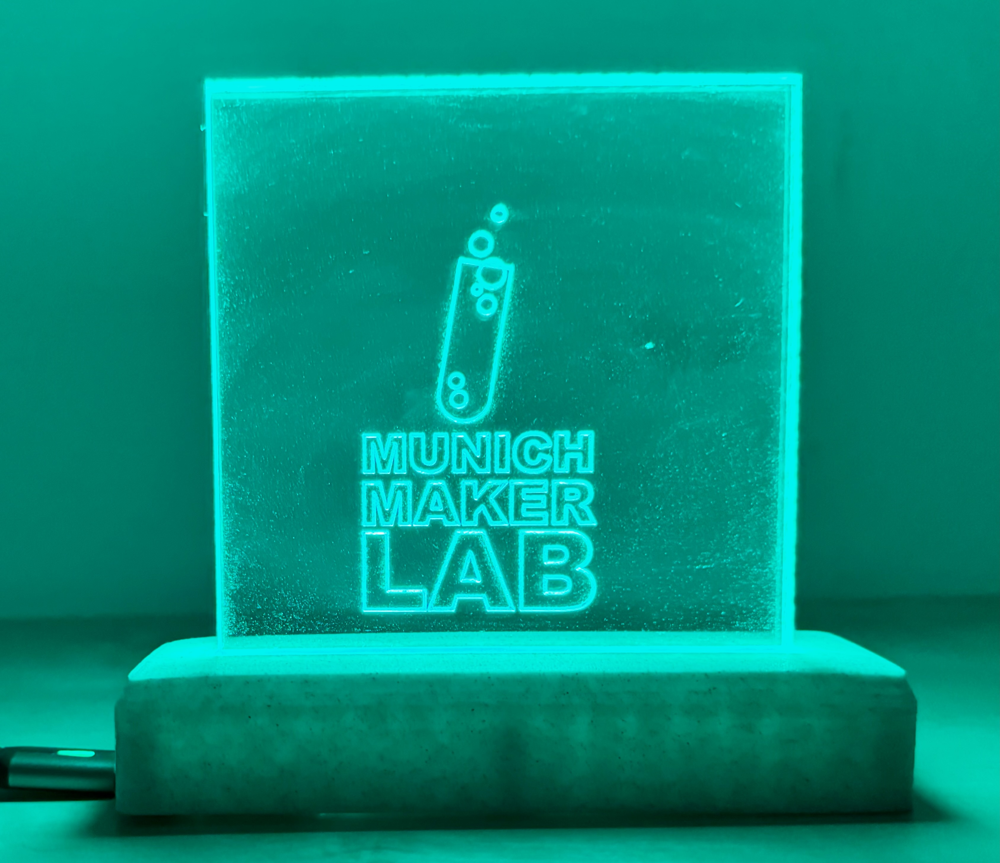
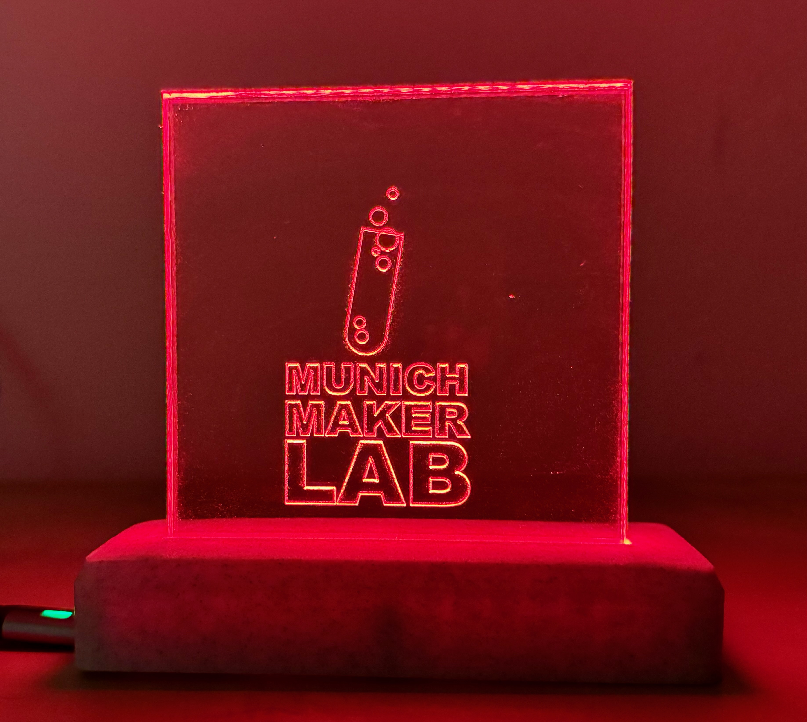

# MuMaLab LED sign

This is a simple project which targets an ESP8266 (or similar) based microcontroller, such as the D1 mini.

It displays the status of the makerspace [Munich Maker Lab](https://www.munichmakerlab.de) by consuming a topic on their their MQTT broker and lighting up an LED strip.

## Setup and configuraition

This is a [PlatformIO](https://platformio.org/) project. You will need to configure the length of your strip and the digital pin to which you wired it in `include/config.h`, and your WiFi credentials in `include/secrets.h`.

## Example

The following example uses an acrylic sign on a [3D-printed base](https://www.printables.com/model/429572-led-lit-acrylic-sign).

